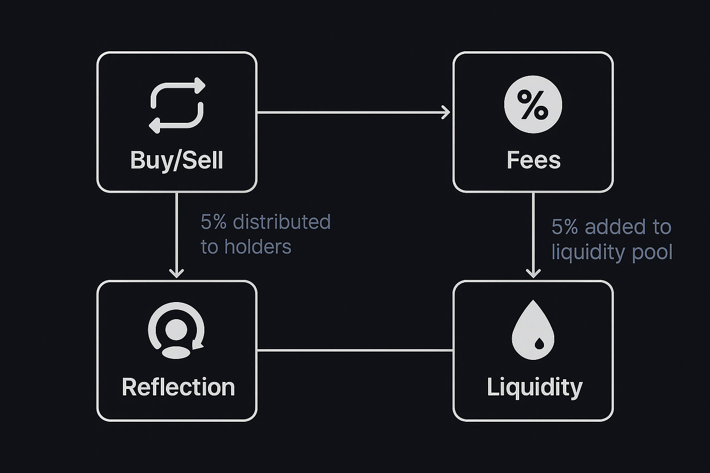

<p align="center">
  
</p>

# 💰 Token Financing – Smart Contract

Plantilla para crear un contrato inteligente ERC-20 avanzado con múltiples funcionalidades de financiación, comisiones, recompensas y control de liquidez.

---

## 📊 Diagrama de Flujo

<p align="center">
  
</p>

Este diagrama representa el flujo de funcionamiento del contrato:
- Al comprar o vender, se aplica una comisión.
- Parte de esta comisión se redistribuye a los holders (reflejo).
- Otra parte se añade automáticamente al fondo de liquidez.

---

## 📜 Características principales

- ✅ Token ERC-20 compatible
- 🔁 Sistema de reflejos (rewards automáticos)
- 💧 Generación automática de liquidez
- 🧾 Comisiones configurables (recompensas, liquidez, desarrollo, marketing)
- 📈 Slippage ajustable
- 🚫 Exclusión de recompensas y comisiones por dirección
- 💼 Control completo del propietario
- 🔒 Recuperación de tokens y fondos bloqueados
- 🦄 Compatible con Uniswap V2

---

## 🧩 ¿Usarlo como plantilla?

Puedes utilizar este contrato como base para tu propio token. Solo adapta:
- El nombre y símbolo
- Las comisiones predeterminadas
- Las direcciones de billeteras
- Los límites máximos de transacción/cartera
- 

## ⚙️ Funciones detalladas

### 🔹 Información del Token
- `name()` → Devuelve el nombre del token.
- `symbol()` → Devuelve el símbolo del token.
- `decimals()` → Retorna los decimales del token (generalmente 18).
- `totalSupply()` → Muestra el suministro total del token.

### 🔹 Balance y Transacciones
- `balanceOf(address)` → Balance actual de un usuario.
- `transfer(address, uint256)` → Envía tokens a otro usuario.
- `transferFrom(address, address, uint256)` → Transferencia con aprobación previa.
- `approve(address, uint256)` → Autoriza a un tercero a gastar tokens.
- `allowance(owner, spender)` → Consulta el límite aprobado.
- `increaseAllowance(spender, addedValue)` → Aumenta ese límite.
- `decreaseAllowance(spender, subtractedValue)` → Disminuye ese límite.

### 🔹 Recompensas y Reflejos
- `tokenFromReflection(rAmount)` → Convierte reflejos a tokens.
- `reflectionFromToken(tAmount, deductFee)` → Convierte tokens a reflejos.
- `totalFees()` → Total acumulado de comisiones.
- `isExcludedFromReward(account)` → Si está fuera del sistema de recompensas.
- `excludeFromReward(account)` / `includeInReward(account)` → Controla participación en recompensas.

### 🔹 Comisiones y Slippage
- `setFees(reflection, liquidity, dev)` → Configura las comisiones.
- `setSlippageToleranceBps(value)` → Define la tolerancia de slippage.
- `getCurrentSlippageToleranceBps()` → Devuelve el slippage actual.
- `excludeFromFee(account, true/false)` → Excluye una cuenta de pagar comisiones.
- `isExcludedFromFee(account)` → Verifica si está exenta.

### 🔹 Límites y Trading
- `setMaxTxAmount(value)` → Máxima cantidad por transacción.
- `setMaxWalletAmount(value)` → Máximo de tokens por wallet.
- `setSwapAndLiquifyEnabled(bool)` → Habilita/desactiva liquidez automática.
- `setMinTokensBeforeSwap(value)` → Mínimo antes de hacer swap.

### 🔹 Carteras del Proyecto
- `setDevWalletAddress(address)` → Dirección de desarrollo.
- `setLiqWalletAddress(address)` → Dirección de liquidez.
- `setMkWalletAddress(address)` → Dirección de marketing.
- `setChaWalletAddress(address)` → Dirección de caridad.

### 🔹 Seguridad y Recuperación
- `withdrawStuckETH()` → Extrae ETH atascado en el contrato.
- `recoverERC20Token(token, to, amount)` → Recupera tokens enviados por error.

---

## 💻 Ejemplos de Uso

### web3.js
```js
const contract = new web3.eth.Contract(ABI, contractAddress);
await contract.methods.transfer("0xRecipient", "1000000000000000000").send({ from: myWallet });
```

### Solidity (uso del token)
```solidity
IERC20(token).transferFrom(msg.sender, address(this), amount);
```

---

## 🔗 Integraciones externas

- OpenZeppelin para seguridad y buenas prácticas.
- Uniswap V2 para operaciones automáticas de liquidez.

---

## 🚀 Cómo compilar e implementar en Remix

Puedes compilar e implementar este contrato fácilmente usando [Remix IDE](https://remix.ethereum.org/), una plataforma web para contratos inteligentes Solidity.

### 🧪 Pasos para compilar:

1. **Abre Remix:**  
   👉 https://remix.ethereum.org/

2. **Crea un nuevo archivo:**  
   - Haz clic en el icono 📄 de archivos
   - Llámalo `JARVI_Token_Financing.sol`
   - Pega todo el código del contrato dentro

3. **Configura el compilador:**  
   - Abre el icono del compilador (📦)
   - Selecciona **Solidity version 0.8.11**
   - Habilita ✅ "Enable Optimization"
   - Asegúrate de activar también **viaIR** si tu contrato lo requiere

4. **Carga configuración personalizada:**  
   Si deseas que compile correctamente con todos los detalles técnicos, puedes usar este archivo:

   **`compiler_config.json`**:
   ```json
   {
     "language": "Solidity",
     "settings": {
       "optimizer": {
         "enabled": true,
         "runs": 1000
       },
       "viaIR": true,
       "outputSelection": {
         "*": {
           "": ["ast"],
           "*": [
             "abi", "metadata", "devdoc", "userdoc", "storageLayout",
             "evm.legacyAssembly", "evm.bytecode", "evm.deployedBytecode",
             "evm.methodIdentifiers", "evm.gasEstimates", "evm.assembly"
           ]
         }
       }
     }
   }
   ```

   Puedes cargar este archivo usando el módulo de configuración en Remix o incluirlo como referencia para compiladores externos como `solc`.

5. **Desplegar el contrato:**
   - Ve a la pestaña **Deploy & Run Transactions (🚀)**
   - Elige `Injected Web3` (para MetaMask) o `Remix VM`
   - Selecciona `JARVI_Token_Financing` en el desplegable
   - Haz clic en **Deploy**
   - Confirma la transacción si estás en testnet o mainnet

---

## 🛡️ Seguridad

Este contrato usa las mejores prácticas de OpenZeppelin y `SafeMath` para prevenir errores críticos como desbordamientos o accesos indebidos.

---

## 📄 Licencia

Licenciado bajo MIT.

---

## 🤝 Contribuciones

¡Pull requests y sugerencias son bienvenidas!
